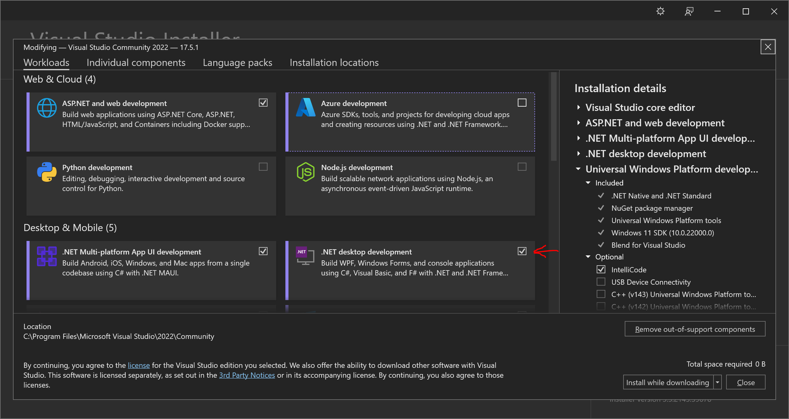

# Week 1 Resources

## Installing Visual Studio 2022

Install Visual Studio 2022 Community from [here](https://visualstudio.microsoft.com/downloads/).

When you install, make sure you check ".NET Desktop Development" in the Workloads display.

Checking other features is optional for this course, but you can do so if you want to explore.

When you are asked to sign in to a Microsoft account, you can use your StarID account (starid@go.minnstate.edu) and password. 

## This Week's Material

### C# Language - Core Syntax and Constructs

* [A tour of the C# language](https://learn.microsoft.com/en-us/dotnet/csharp/tour-of-csharp/) at Microsoft.
* [C# Coding Conventions](https://learn.microsoft.com/en-us/dotnet/csharp/fundamentals/coding-style/coding-conventions) at Microrsoft.
* [C# Syntax](https://www.csharptutorial.net/csharp-tutorial/csharp-syntax/) at CSharpTutorial.net.

### C# Data Types

* [C# Type System](https://learn.microsoft.com/en-us/dotnet/csharp/fundamentals/types/) at Microsoft.
* [C# Value Types](https://learn.microsoft.com/en-us/dotnet/csharp/language-reference/builtin-types/value-types) from Microsoft. Also view the rest of the pages in the Value Types section, on the left of the page (integral numeric types, floating point numeric types, etc.)
* [C# Data Types](https://www.w3schools.com/cs/cs_data_types.php) at W3Schools.

### C# Terminology

* [Terms and Definitions](https://learn.microsoft.com/en-us/dotnet/csharp/language-reference/language-specification/terms-and-definitions) at Microsoft.

## Useful resources for C# in general

* [C# Language Specification](https://learn.microsoft.com/en-us/dotnet/csharp/language-reference/language-specification/introduction).
* [Learn C#](https://dotnet.microsoft.com/en-us/learn/csharp) at Microsoft - Hub for many resources including videos, examples and references for C#.
* [C# Documentation](https://learn.microsoft.com/en-us/dotnet/csharp/) at Microsoft - another hub for C# documentation.
* [C# Corner](https://www.c-sharpcorner.com/) - a blog and learning site with a *lot* of C# content. 