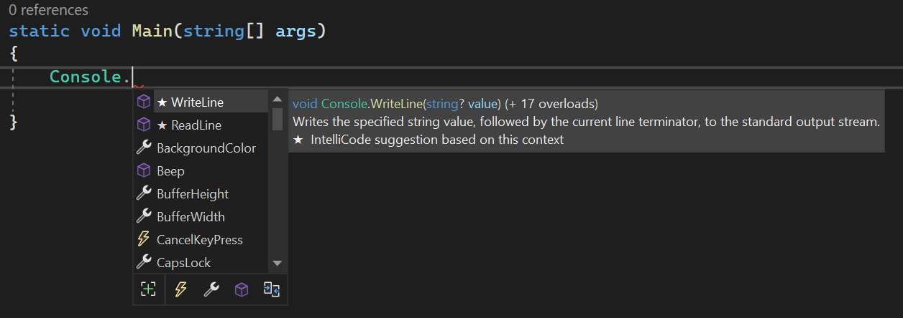
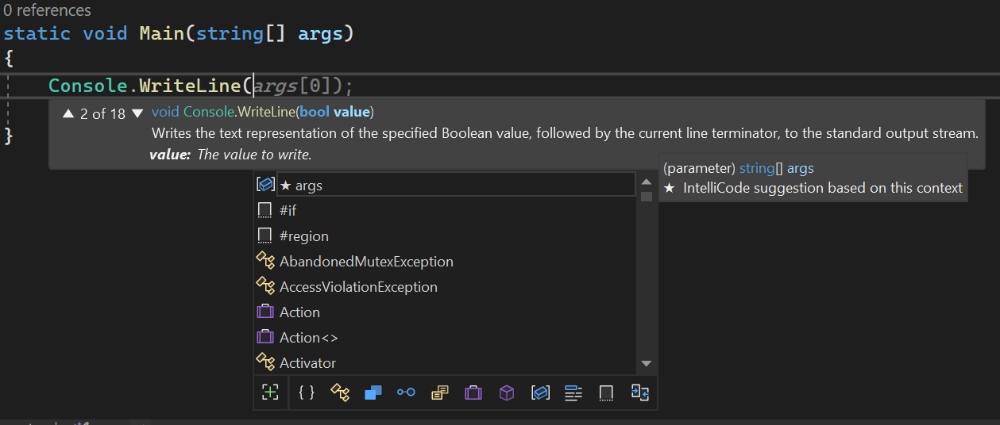

# Week 5 Resources and Presentation Guides

This week's presentations focus on code documentation, organization, refactoring and libraries.

**Wednesday**:

- [Namespaces, Using statements and Global Usings](#namespaces-using-statements-and-global-usings)
- [Class Libraries](#class-libraries)
- [IntelliSense and Hints](#intellisense-and-hints)

**Friday**:

- [XML Inline Documentation](#xml-inline-documentation)
- [Code Refactoring](#refactoring)
- [Code Analysis](#code-analysis)
- [SPECIAL TOPIC: C# Testing with MSTest](#special-topic-mstest)

## Namespaces, Using statements and Global Usings

C# code is organized into *namesapces*. Many other languages use a very similar paradigm for organizing code into groups of objects. In C#, namespaces typically contain classes and interfaces. 

In C#, similarly to Java, most of the objects provided by the framework are located within the `System` namespace. For example, the `Console.WriteLine()` method we have been using regularly is actually part of the `System` namespace. (`Console` is a *static class* - a class that contains only static members, and thus is not ever directly instantiated.)

You may have noticed that you actually can use `Console.WriteLine` without importing `System` using the `using System;` statement. This is because C# (at least, as of version 10) has a function known as *implicit usings*. This function works in tandem with another newer function known as *global usings*.

Global usings allow you to write a `using` statement in one file that applies to *all* files in the project. For example, if you included the following statement within your `Program.cs` file:

    global using System;

every `.cs` file in your program would behave as if it had `using System;` at the top. You can define as many `global using` statements as you like, and repeating the same `global using` statement in many places should not cause a problem. 

You can go one step further by using the `static` modifier. For example, if you add `global static using System.Console;` to your `Program.cs` file, now *every* file in your program can simply call `WriteLine(...)` to write something to the console.

The implicit usings feature builds on the capability of global usings by automatically generating a global usings file for you. The list of namespaces that are included is based on the project type. Since we have been working with the .NET Console App template, namespaces such as `System` are imported automatically for us. 

### Using your own namesapces

It is a good idea for you to organize your code into your own namespaces. A namespace is simply a "path", with each component separated by periods. `System.Net`, `System.Linq`, `FlintMillion.Programs.MyApp` and `MNSU.CS.Projects.CS403.Week5` are all valid namespaces. When you are simply working with a `Main` method and perhaps a few supporting methods or a class or two, simply having a root-level namespace for your program (such as `Week4Homework`) is usually sufficient. However, as you start to write more complex code, you'll find that organizing your code into namespaces can be very useful.

All of the code (classes, interfaces, etc.) within a `.cs` code file can be wrapped inside a `namespace` block. You have probably already seen this, but it looks like this:

    using System;
    // other using statements

    namespace MyCompany.MyProgram
    {
        public class Program
        {
            public void Main()
            {
                // ...
            }
        }
    }

All of the items within this `.cs` file, which are inside the `namespace` block, will exist within the given namespace. In other `.cs` files, you can provide the same namespace (all of the objects will simply be combined into that namespace from all of the files using it), or you can specify a different namespace. 

It's also important to remember that if you put code in a different namespace, you either need to include that namespace using a `using` directive, or you need to fully qualify the path to a class. (Objects in the same namespace as the file your code is in are implicitly available, but any other namespaces - even sub-namespaces - must be explicitly imported).

    namespace MyCompany.MyProgram.Utils
    {
        public static class UtilityFunctions
        {
            public static void DoSomething() 
            {
                // a method that does something
            }
        }
    }

    namespace MyCompany.MyProgram
    {
        public static class Program
        {
            public static void Main()
            {
                // This is invalid code - even though Utils is a sub-namespace of our namespace MyCompany.MyProgram,
                // we can't use it without explicitly importing the namespace, or by fully qualifying the path
                // to the object.
                UtilityFunctions.DoSomething();

                // This IS valid and will work without a using statement.
                MyCompany.MyProgram.Utils.UtilityFunctions.DoSomething();
            }
        }
    }

You also can always directly reference an object by its full path. Even with no `using` statements at all, you could use `System.Console.WriteLine` to access the `Console.WriteLine` method. `using` statements simply allow you to abbreviate your code to make it more readable - everything in the namespace that you import with `using` is available without specifying the full path to the object. 

Namespaces can become especially important when you start separating out parts of your code into *class libraries* (another topic for today's presentations). All C# libraries place their code objects within a namespace for that library - commonly, it follows a pattern similar to the ones I've described so far, but as long as the pattern is unique enough that it is extremely unlikely that other code will conflict with it, it will work fine.

In Visual Studio, you can explore the entire set of namespaces and their objects with the *Object Explorer*, which is available under the `View` menu. The Object Explorer gives you a friendly tree view interface with which you can explore and navigate all of the namespaces that are available in your project. This includes all of the system namespaces as well as the namespaces for your own code and for any libraries you might have imported into the project. 

### Namespace Caveats

It's possible to have objects in two different namespaces that have an identical name. For example, you might have a `DoSomething` method, on a class called `Utilities`, in both the `MyCompany.MyProgram` namespace as well as the `OtherCompany.Program` namespace. When an ambiguity occurs, the compiler will refuse to compile your code and you will be required to fully qualify the name of the class, method, or other object you are intending to use. This will only happen for objects that are ambiguous - i.e. they share an identical name other than the namespace. Be cautious with this especially if you're using static using statements; sometihng like `using static System.Console` means you can use `WriteLine` with no qualifier, but it could actually make your code *less* readable since many other objects also contain a `WriteLine` method (such as the `Debug` object, streams and more).

While you can come up with your own namespaces, you should be careful to minimize any chance that your namespace might get "overridden" by another code library. For example, simply naming your namespace `Utilities` is probably a poor idea. Instead, something like `MyCompany.Utilities` is better, since `MyCompany` is (ideally) a unique company name and thus the chances of a collision are very low. In the same vain, you should refrain from creating any custom namespaces that start with `System`, as the `System` namespace is reserved for the .NET framework's library objects. While the language will not explicitly *prevent* you from putting your code in, say, `System.Utilities`, this is extremely ill-advised, as the `System` namespace is generally assumed to be consisten and documented.

One other point to keep in mind is that importing a namespace does *not* implicitly import any sub-namespaces. For example:

    namespace MyApp
    {
        public class Program 
        {
            // ...
        }
    }

    namespace MyApp.Utilities
    {
        public class Utils
        {
            // ...
        }
    }

In this example, if you were to use `using MyApp;`, you would *not* get access to `MyApp.Utilities` implicitly. Despite `Utilities` appearing to be under `MyApp`, you still need to *explicitly* import `MyApp.Utilities` if you want the objects from that namespace available in your code directly. (You can, of course, always use the full path, i.e. `MyApp.Utilities.Utils`, even without the extra `using` statement.)

One final point - the `using` keyword has *two* uses in C#. When used at the top of a source code file, it is used to import namespaces into the workspace for that file. However, it is also seen in the context of disposable objects  such as file handles or network sockets (for example: `using (StreamReader sr = File.Open("file.txt")) { ... }`). Make sure not to confuse the two when you're studying material on the `using` statement!

In your presentation, please cover:

- What are C# namespaces? How do they compare to namespaces used in other programming languages, such as Java or Python?
- Explain how you can view the list of objects within namespaces using the Object Browser in Visual Studio.
- Provide an overview of placing your code within a custom namespace and how to access that code from other code files or blocks. Don't worry about moving code to different files or projects - that's a topic for another presentation.
- Compare/contrast how other languages handle namespaces. For example, Java and Python use very similar notation (dot notation) to specify paths to objects within namespaces. Other languages use different separators (such as `::` or `->`) to specify namespace paths.

Sources to get you started (but please do seek out and use other sources as well!):

- [using directive](https://learn.microsoft.com/en-us/dotnet/csharp/language-reference/keywords/using-directive) at Microsoft.
- [Organizing types into namespaces](https://learn.microsoft.com/en-us/dotnet/csharp/fundamentals/types/namespaces) at Microsoft.
- [Implicit global using](https://endjin.com/blog/2021/09/dotnet-csharp-10-implicit-global-using-directives)

## Class Libraries

So far, we have written all of our C# code in a single *project* - a unit that compiles to a single assembly. However, like many other languages, C# offers a way to package up some code into a *library* that can be imported into another project. In C#, this is known as a *class library* (because the fundamental code object is a class!). 

We have been using the .NET Console App template for our code thus far. A .NET console app, along with many other types of projects, is designed to be directly executed. A class library, in contrast, is not intended for direct execution. It does not have to contain a static `Main` method. However, it can contain any C# code you desire. 

C# class libraries compile to `.dll` files. The name of the `.dll` is typically the namespace the code exists within. (There's nothing preventing one DLL from putting code in multiple namespaces, but this is uncommon and can lead to confusion - the most prominent example is actually the .NET Framework itself, where some `.dll` files include code for multiple `System` namespaces.) You can then add the `.dll` file to another project and access all of its classes and objects by simply importing (with `using`) the correct namespace in your code. The C# compiler will figure out how to access the appropriate code within your DLL file when it is necessary to do so. 

You can also split your code into a class library without setting up separate projects. Visual Studio implements the idea of a *solution* - a group of projects that work together as one unit. A solution can contain multiple executalbe projects (for example, a command line version as well as a GUI version, or even a mobile app) as well as supporting class libraries. Each of the executable projects can directly access the class library without needing to explicitly import it - you just need to use the appropriate `using` statements.

A related topic to class libraries is Microsoft's *NuGet* package repository. The NuGet repository is similar to `pip` in Python or `maven` in Java. It's a centralized repository of code libraries, nearly all written in C# (but all written for the .NET framework). NuGet packages can be imported into your project, which will download the library's code into your project. Publishing a library to NuGet is outside the scope of our course, but the homework for this week will include adding one library to your project from NuGet.

For your presentation, please cover:

- What is a class library in C#?
- Explain the concept of a solution and how it relates to the many projects contained therein.
- Provide either a demonstration or an overview of how you would go about adding a class library to your C# solution, and then using it from another project in the same solution.
  - We won't worry about distributing the DLL file and loading it into a completely unrelated solution for now.
- Consider how other programming languages implement sharable code libraries. Compare and contrast C#'s strategy with other languages. For example, Python uses the idea of *packages*, where you can use an `__init__.py` file to designate a directory as a package and can then `import` it into your code using `import` statements.
- What is NuGet? How does it compare to other repositories for other languages? 

Sources to get you started (but please do seek out and use other sources as well!):

- [Class Libraries](https://learn.microsoft.com/en-us/dotnet/standard/class-libraries) at Microsoft.
- [Creating a Class Library in C#](https://www.c-sharpcorner.com/UploadFile/61b832/creating-class-library-in-visual-C-Sharp/) at CSharpCorner.
- [What are solutions and projects?](https://learn.microsoft.com/en-us/visualstudio/ide/solutions-and-projects-in-visual-studio?view=vs-2022)

## IntelliSense and Hints

You have probably noticed by now, if you're using Visual Studio (many other C#-focused IDEs and IDE plugins will do this as well), that as you write code, popups will appear with suggestions or lists of available objects. For example, if you type `Console.` and wait a moment, a list will appear showing you all of the methods and properties available on the `Console` object. This feature is known by Microsoft as *IntelliSense* and it has been a key feature of Visual Studio for many years, going back to versions of Visual Studio even prior to the C# language's existence. 

IntelliSense is a feature of the IDE (in this case Visual Studio), not a language feature on its own. IntelliSense is aware of the programming language's syntax and pops up when you've entered a partial object identifier or similar construct. If you type `Console.` it will pop up all objects available on that object. If you start typing a method call, like `Console.WriteLine(`, it will pop up with the parameters for the method. In the case of an overloaded method, where there are multiple ways you can call it based on the parameters, it will give you arrows you can click (or use the arrow keys) to switch between the different method signatures. 

Another IntelliSense feature is *tab completion*. Once you've typed enough of an object's name to disambiguate it from other similarly-named objects, you can simply press the **Tab** key and Visual Studio will fill in the rest of the name for you. Even if there is still ambiguity, IntelliSense will still try to auto-complete using the most commonly used object name. For example, you can type `Cons <tab> .Wr <tab>` and you'll have `Console.WriteLine`. It might take some experimenting to find out just how much disambiguation you have to do, but the IntelliSense popups will help you. With some skill, you can write code at super-speeds using this technique!

Another feature is the Hints feature. Hints are prompts that IntelliSense offers to you, either as ideas for how to fix a known code issue, or as suggestions based on coding practices. There is a large amount of configurability of how the code analyzer works that is beyond the scope of this discussion, but be aware that you can configure Visual Studio to enforce various code styles and quality aspects, especially issues that might create potential bugs. For example, if you are using a nullable type (one ending with a `?`) in a context where a null value is not allowed, the code analyzer can warn you that a null value might produce an exception. (If the value is not null, the nullable type will be automatically cast to the non-nullable type, but a null value could produce unexpected results.) Situations like this are typically marked as warnings, since it does not necessarily prevent your code from working, but you need to be aware of it in case there is any scenario in which the value might be null. (Contrast this with Java, which often *requires* you to implement exception handling, even in situations where you may have near-100% assurance that the exception in question will never occur.)

Hints are available when you see a light-bulb icon or a screwdriver icon in the left column. If you are on the line on which the hint is available, you can press Ctrl+. (Control+period/full-stop) to bring up the hint popup and see the available options. You can also click on the icon itself to bring up the list of options. Many of the options are automatic and IntelliSense can make changes to large sections of code for you automatically. Of course it is always a good idea to review the changes made by IntelliSense, but since IntelliSense is able to understand the code at a syntactic level, it is often quite reliable in making changes to code - even widespread changes. (We'll hear more about this in Friday's discussion on refactoring - imagine changing the name of a class and having that change propagate automatically throughout your *entire* project!)

In your presentation, please cover:

- What is IntelliSense? (Is it a language feature or an IDE feature?)
- What functions can IntelliSense offer to you as a developer?
- Show a couple of examples of IntelliSense in action. You can either do a live demo or some screenshots.
- Pick at least one other IDE other than Visual Studio and investigate how it provides similar features for code analysis and "helper" features. (VS Code, JetBrains, etc. are all valid choices.)

Sources to get you started (but please do seek out and use other sources as well!):

- [C# IntelliSense](https://learn.microsoft.com/en-us/visualstudio/ide/visual-csharp-intellisense?view=vs-2022) at Microsoft.
- [Quick Actions](https://learn.microsoft.com/en-us/visualstudio/ide/quick-actions?view=vs-2022) at Microsoft.
- [Light Bulb Suggestions](https://learn.microsoft.com/en-us/visualstudio/extensibility/walkthrough-displaying-light-bulb-suggestions?view=vs-2022)

## XML Inline Documentation

Coming soon

## Refactoring

Coming soon

## Code Analysis

Coming soon

## SPECIAL TOPIC: MSTest

We will have a special topic presentation this week on MSTest, the built-in testing framework for C#
